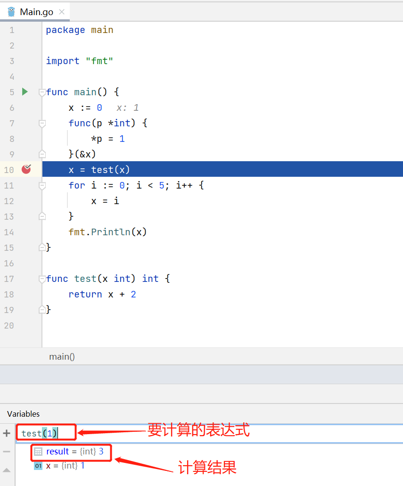

# 检查暂停的程序

调试会话器启动后，将出现[调试](https://www.jetbrains.com/help/go/debug-tool-window.html)工具窗口，然后直到下面之一的情况发生程序都会正常运行：

1. 一个[断点](断点.md)被命中
2. 你手动暂停程序

然后，程序被暂停了，这能让你检查它的当前状态，控制其进一步执行，并在运行时测试多种场景。

> 如果你不小心关闭了**调试**工具窗口，在主菜单中选择**视图|工具窗口|调试**或按`Alt+5`去重新打开它。

## 检查帧

程序的状态将由 *帧* 表示。当程序被暂停时，当前帧栈将会**调试**窗口在**帧**（**Frames**）的标签页展示。

帧对应于活动的方法或函数调用。它存储被调用方法或函数的本地变量，参数，和能够计算表达式代码上下文。

为了更好地了解帧的概念，让我们看看程序运行时会发生什么。程序从`main`函数开始执行，`main`方法反过来调用其它方法。这些方法中的每一个都可以进行更多的方法调用。每个方法调用的局部变量和参数的集合由帧表示。每当一个方法被调用，一个新的帧被加入到栈顶。当方法执行结束，相应的帧将会被从栈移除（用的后入先出风格）。

检查帧帮助你理解为什么特定的参数会被传递到方法和调用者在调用时的状态。

> #### 复制栈到剪贴板
>
> - 为了复制调用栈到当前线程，右键帧标签的任何地方并选择**复制栈**（**Copy Stack**）。

> #### 在一个标签页中连续预览帧
>
> 预览标签允许你在一个标签页中成功打开多个文件。这样可以避免在单独的选项卡中使用多个打开的文件使编辑器变得混乱。
>
> - 要为调试期间打开的文件启用预览模式，请按Ctrl+Alt+S打开设置，导航到**编辑器|常规|编辑器选项卡**（**Editor|General|Editor Tabs**），然后选中**启用预览选项卡**(**Enable preview tab**)复选框。
>
>   

> #### 隐藏对象类型
>
> 如果对象类型在**调试**（**Debug**)工具窗口占据了太多空间，右键一个变量并清除显示列表中的**显示类型**（**Show Types**)选项。
>
> 

## 在转储（dump）选项卡中筛选goroutines列表

你可以转储（dump）你程序使用的所有的goroutines，应用搜索特定goroutine的筛选器，并研究过滤结果。此过程能帮助你更好了解你的程序或其部分是如何工作的。

例如，下面的截图显示了`Goroutine 7 main.pageSize`的执行栈。goroutines列表中的一个groutine名字是'Goroutine<ID> <last_non-runtime_function_on_the_stack>'。非运行时意味着这个函数没有在运行包中。

> #### 转储（Dump）goroutines
>
> 在一个调试器会话中，点击**转储 Groutines**（**Dump Goroutines**）按钮（）。
>
> 一个可用的goroutines的转储和它们的栈将会在一个单独选项中打开。
>
> 

> #### 过滤转储结果
>
> - 点击**过滤**（**Filter**）图标（![过滤图标]https://resources.jetbrains.com/help/img/idea/2021.3/icons.general.filter.svg))， 输入你想要搜索的字符串。
>
>   
>
> - 右键你想要从列表中排除的goroutine并选择**隐藏goroutine**，要隐藏所有和选择的goroutine由相同栈的gotoutine，从上下文菜单中选择**隐藏有相同栈的goroutine**（**Hide goroutines with the same stack**)。
>
>   你能在**隐藏**（**Hidden**）列表中看到被隐藏的goroutine
>
>   要重置列表的状态并使全部隐藏的goroutines再次显示在可见列表中，点击**重置隐藏Goroutine**（**Reset Hidden Goroutines**）按钮（)
>
>   

> #### 将转储结果导出到文本文件中
>
> 1. 点击**导出到文本文件**（**Export to Text File**)图标（)
> 2. 在**导出到文件**（**Export to File**)视图中，选择存储路径并点击**保存**（**Save**）。
>
> 

## 检查/更新变量

变量选项卡显示被选择的[帧/线程](#检查帧)。对变量的了解有助于理解程序为何以某种方式运行。

> 注意变量的作用域和生命周期。如果一个变量不在列表中，这表示该变量在当前执行点跳出了当前帧的作用域。

每个变量左侧的图标指示其类型

### 变量类型

> #### 复制变量
>
> 当检查变量时，你可能需要复制变量名或值去粘贴它到某个地方或与其它变量比较
>
> - 要复制一个变量拥有的值，右键变量并选择**复制值**（**Copy Value**）`Ctrl+C`
> - 要复制一个变量名，右键变量并选择**复制名**（**Copy Name**）

> #### 用剪贴板比较变量
>
> 当你需要将变量值与其它值比较时，使用**用剪贴板比较变量**（**Compare Value With Clipboard**)选项。这是非常有用的，例如，当你的变量有很长的字符串，并且你需要与其它长字符串进行对比。
>
> 1. 复制你将要对比的内容（例如，从一个文本文件中）
>
>    
>
> 2. 在**变量**（**Varables**）选项卡中，右键你想要对比的的变量并选择**用剪贴板比较值**（**Compare Value with Clipboard**)。
>
> 3. 在打开的 Diff Viewer 中检查差异，为了获取更多信息来高效使用 Diff Viewer，参考[比较文件和文件夹](https://www.jetbrains.com/help/go/comparing-files-and-folders.html)的主题。
>
>    

> #### 在专用对话框中查看变量
>
> Goland 允许你在一个专用对话框中检查变量，当你需要追踪某些变量（或其引用的对象）并且同时在帧和goroutine 中跳转，这将是非常有用的。
>
> - 在变量选项卡中右键变量并选择**检查**（**inspect**）
>
>   

> #### 设置变量值
>
> 如果需要测试在特定条件下程序如何表现或在运行时修复其当前行为，你可以通过设置/改变变量值来做到。
>
> 1. 在变量选项卡右键变量并选择设置变量，或选择变量并按`F2`。
> 2. 输入变量值并按`Enter`。
>
> 或者，你可以使用[内联](https://www.jetbrains.com/help/go/examining-suspended-program.html#inline-view)提示弹出窗口设置变量值。单机与所需变量对应的提示，根据需要展开树，然后选择**设置值**(**Set Value**):
>
> 

> #### 导航到源代码
>
> 如果你需要查看声明某些变量或类型的源代码，则可以从**变量**（**Variables**）选项卡移到那里。
>
> - 要移动到生命变量的代码，右键变量并选择**跳转到源代码**（**Jump to Source**）`F4`。
>
>   
>
> - 要跳转到变量类型声明的源代码，右键变量并选择**跳转到类型源码**（**Jump to Type Source**)`F4`。
>
>   

## 计算表达式

Goland 让你在调试器会话期间计算表达式去获取程序状态的额外信息或测试运行时的多种场景。

> 当计算表达式时，注意变量的作用域和生命周期。所有表达式在当前执行点的上下文中被计算。

### 在编辑器中计算简单表达式

计算表达式的最简单方法时在代码中指向它。虽然它是最快的方式，但它不能被用于计算方法调用。这样做是为了安全，因为它们可能会产生副作用。

当你需要在编辑器中快速计算表达式时使用这个选项。

> 1. 指向你要计算的表达式。表达式的结果将显示在工具提示中。
>
>    
>
> 2. 如果你需要在查看结果对象的子元素，点击 并按`Ctrl + F1`。
>
>    
>

如果你发现值提示框让你分心，你可以增加延迟或禁止它们。要做到这个，在**设置/偏好设置**(**Settings/Preferences**）对话框（`Ctrl + Alt + S`)，找到**构建，执行，部署|调试器|数据视图**（**Build， Execution，Deployment | Debugger | Data Views**）并根据需要设置**显示值提示条**（**Show value tooltip**）和**值提示条延迟**（**Value tooltip delay**）选项。

## 在编辑器中计算复杂表达式

如果要计算代码中设计方法调用的表达式，或者你想要指定哪部分表达式去计算，使用**快速计算表达式**（**Quick Evaluate Expression**）选项。

这个选项只有在你的程序在命中断点暂停执行时才有用（不是手动暂停）。

> 1. 将插入符号放在表达式处（以计算最接近的匹配表达式）或选择表达式的一部分（若谷希望具体说明计算复杂表达式的哪一部分）。
>
> 2. 点击**运行|调试器行为|快速计算表达式**（**Run | Debugging Actions | Quick Evaluate Expression**）`Ctrl + Alt + F8`。或者，按住`Alt`并单击所选内容。
>
>    
>
>    > 如果表达式调用的方法中存在断点，它们将会被忽略。

> 当调用方法时，确保你意识到它们可能的副作用（例如，更改外部变量），因为它们可能会改变程序流程或结果。

你可以配置**快速计算**(**Quick Evaluate**)来只通过选择它来作用于代码片段（不需要使用菜单/快捷键）。小心使用这个选项，因为当它开启时你可能不小心调用方法。

为了在代码选择中配置**快速计算**(**Quick Evaluate**)，找到**设置/偏好|构建，执行，部署|调试器|数据视图**（**Settings/Preferences | Build, Execution, Deployment | Debugger | Data Views**）并设置**显示值工具条在代码选择时**选项为首选项。

## 计算任意表达式

计算任意表达式是最灵活的计算选项。它让你计算任意代码，只要它在上下文帧中。使用它，你能计算声明，方法调用，循环，匿名类型，lambdas，等等。

使用此功能可以获取有关程序状态的其它信息，并在同一调试会话中测试各种场景。这能通过减少你需要运行调试器会话数目来节省你大量时间。

这个选项只有在你的程序命中后暂停时才有用（手动暂停不行）。

> 1. 如果要从当前在您面前的某个表达式或变量开始（例如，在编辑器或**Variables**（**变量**）选项卡上），请选择它
>
> 2. 点击**运行|调试器选项|计算表达式**`Alt + F8`。这个快捷键在Ubuntu中可能不行（要正确操作，请[调整快捷方式配置](https://www.jetbrains.com/help/go/configuring-keyboard-and-mouse-shortcuts.html)。
>
> 3. 在**计算**对话框中，修改选择的表达式或在表达式区域输入新的表达式。如果要评估代码片段，请单击**展开**（**Expand**）`Shift + Enter`。
>
>    > 记住任何在表达式内部声明的变量将会表达式被计算后失去作用域。
>
> 4. 点击**计算**（**Evaluate**)(对于多行`Ctrl + Enter`)。表达式结果将会在**结果**字段中出现。
>
>    表达式的结果是从返回语句中取出来的。当没有返回语句时，结果将会从最后一行代码取（它甚至不需要是一个表达式：文本也可以）。当没有有效行被取出来值时，结果是`未定义的`(`undefined`）。如果指定的表达式不能被计算，**结果**（**Result**）字段表明原因。
>
>    > 如果表达式调用的方法中有断点，它们将会被忽略。

> 当调用方法时，确保你知道它们可能产生的副作用（例如，外部变量的更改），因为它们可能会改变程序的执行流程或结果。

**计算**对话框是非模态的，因此可以将焦点切换回边界其取复制其它变量和表达式。如果需要的话你也可以开启多个**计算**对话框。

## 内联查看值

Goland 通过在变量的用法旁边显示变量的值来简化调试过程。

一旦变量值被改变，内联视图将会更新成新值并且颜色会改变

默认情况下内联视图是开启的，要关闭它，请在**设置/首选项**（**Settings/Preferences**)对话框（`Ctrl + Alt + S`）中，转到**构建、执行、部署|调试器|数据视图**（**Build, Execution, Deployement | Debugger | Data Views**）, 并禁用**内联值显示**（**Show values inline**)选项。

> ### 添加一个内联监控
>
> 如果希望某个表达式的结果出现在特定行上，可以为此设置一个内联[监控](https://www.jetbrains.com/help/go/examining-suspended-program.html#watches)。内联监控是持久的，在会话重新启动时保持活动状态。
>
> 1. 点击指向要跟踪其字段的对象的内联提示。
> 2. 在弹出框中，选择字段并点击**添加一个内联监控**（**Add as lnline Watch**)。
> 3. 如果需要，可以微调监控。你可以使用任何有效的表达式作为监控。
>
> 要删除一个内联监控，请将鼠标悬停在监控上，然后单击监控附近的十字。
>
> 

## 监控(Watches)

> 如果要查找有关观察点的信息，参考[断点](断点.md)章节。

如果你想要跟踪某些变量或复杂表达式的结果，设置变量或表达式的的监控。当你需要添加变量中不经常显示的内容，或者需要固定某个实例变量，这样就不需要再每个步骤后展开树，这非常有用。

仅当程序在命中断点后暂停（未手动暂停）时，此选项才可用。es

> 调用方法时，请确保您知道它们可能产生的副作用（例如，外部变量的更改），因为它们可能会改变程序流程或结果。

监控将再选定帧的上下文中进行计算。当监控脱离上下文或无法编译时，它无法被计算。如果是这种情况，监控会被标记为错误标志

默认情况下，监控选项卡是隐藏的并显示再变量选项卡上。要隐藏/显示监控选项卡，在变量或监控选项卡使用**在变量选项卡显示监控**(**Show watches in variables tab**)按钮

> #### 添加监控
>
> 1. 在变量选项卡点击**添加新的监控**]（**New Watch**)
>
> 2. 输入要计算的变量或表达式。在表达式中，只要在本地上下文中，就可以计算方法调用，函数文本和声明变量等。
>
>    
>
>    > 